# VET-PATHSHALA APP - PAGE FLOW & NAVIGATION STRUCTURE

## 🎯 Project Overview
**Vet-Pathshala** is a comprehensive educational platform designed for three user categories:
- **Veterinary Doctors** - Advanced learning & professional development
- **Pharmacists** - Medicine-focused education & drug calculations  
- **Farmers** - Practical animal care & prevention knowledge

Built with **Flutter** and **Firebase**, featuring role-based access, gamification, AI integration, and subscription-based monetization.

---

## 📱 COMPLETE PAGE INVENTORY

### 🔐 AUTHENTICATION FLOW
| Page | File Path | Purpose |
|------|-----------|---------|
| **Splash Screen** | `shared/screens/splash_screen.dart` | App intro & auto-navigation |
| **Onboarding** | `login/onboarding/onboarding_widget.dart` | 3-screen app introduction |
| **Role Selection** | `features/auth/screens/role_selection_screen.dart` | Choose user type |
| **Login** | `login/login/login_widget.dart` | Email/Phone authentication |
| **Phone Verification** | `login/login_verify/login_verify_widget.dart` | OTP verification |
| **Profile Setup** | `login/signup_profile/signup_profile_widget.dart` | Complete user profile |

### 🏠 MAIN NAVIGATION HUB
| Page | File Path | Tab Position |
|------|-----------|--------------|
| **Home Dashboard** | `home/home_widget.dart` | Tab 1 |
| **Library** | `library/library_widget.dart` | Tab 2 |
| **Battle Center** | `battle/` (multiple pages) | Tab 3 |
| **Profile** | `profile/profile_widget.dart` | Tab 4 |
| **Settings** | `settings/settings_widget.dart` | Tab 5 |

### 📚 LEARNING MODULES

#### Question Bank System
| Page | File Path | Function |
|------|-----------|----------|
| **MCQ Bank** | `questionbank/m_c_q_bank/m_c_q_bank_widget.dart` | Category → Subject selection |
| **Questions List** | `questionbank/questions_list/questions_list_widget.dart` | Topic-wise question listing |
| **Question Practice** | `questionbank/question_bank_page_view/question_bank_page_view_widget.dart` | Individual question interface |

#### Short Notes System
| Page | File Path | Function |
|------|-----------|----------|
| **Notes Bank** | `short_notes/short_notes_bank/short_notes_bank_widget.dart` | Category → Subject → Topic nav |
| **Notes List** | `short_notes/short_notes_list/short_notes_list_widget.dart` | Topic-wise notes listing |
| **Notes Reader** | `short_notes/short_notes_page_view/short_notes_page_view_widget.dart` | AI-enhanced reading experience |

#### Quiz & PYQ System
| Page | File Path | Function |
|------|-----------|----------|
| **Quiz Details** | `quiz/quizdetails/quizdetails_widget.dart` | Quiz info & start screen |
| **Quiz Interface** | `quiz/quizpage/quizpage_widget.dart` | Timed quiz practice |
| **Quiz Results** | `quiz/quiz_page_view/quiz_page_view_widget.dart` | Performance analysis |

### 🎮 GAMIFICATION SYSTEM

#### Battle Module
| Page | File Path | Purpose |
|------|-----------|---------|
| **Battle Join** | `battle/battle_join_page/battle_join_page_widget.dart` | Category & mode selection |
| **Create Room** | `battle/create_room/create_room_widget.dart` | Generate room codes |
| **Join Room** | `battle/join_room/join_room_widget.dart` | Enter room codes |
| **Battle Wait** | `battle/battle_wait_page/battle_wait_page_widget.dart` | 1v1 waiting lobby |
| **Group Battle Join** | `battle/group_battle_join_page/group_battle_join_page_widget.dart` | Multi-player lobby |
| **Group Battle Wait** | `battle/group_battle_wait_page/group_battle_wait_page_widget.dart` | Group waiting room |
| **Battle Arena** | `battle/battle_page/battle_page_widget.dart` | Live battle interface |
| **Battle View** | `battle/battle_page_view/battle_page_view_widget.dart` | Real-time progress |
| **Battle Results** | `battle_winner_page/battle_winner_page_widget.dart` | Winner announcement |

### 💊 DRUG CALCULATOR MODULE
| Page | File Path | Purpose |
|------|-----------|---------|
| **Drug Home** | `drugindex/drughome/drughome_widget.dart` | Calculator & index hub |
| **Drug Index** | `drugindex/drug_index/drug_index_widget.dart` | Medicine database |
| **Dose Calculator** | `drugindex/drug_indexcalculator/drug_indexcalculator_widget.dart` | Dosage calculations |

### 📊 USER MANAGEMENT
| Page | File Path | Purpose |
|------|-----------|---------|
| **Notifications** | `notifications/notifications_widget.dart` | Push notification center |
| **States Selection** | `states/states_widget.dart` | Geographic categorization |
| **State Content** | `state_page/state_page_widget.dart` | Location-based materials |

### 🎓 EXAMINATION MODULE
| Page | File Path | Purpose |
|------|-----------|---------|
| **Exam Categories** | `exam/exam_widget.dart` | Exam type selection |
| **Exam Interface** | `exam_page/exam_page_widget.dart` | Formal assessment mode |

### 💰 MONETIZATION SYSTEM
| Page | File Path | Purpose |
|------|-----------|---------|
| **Coin Store** | `coin_store/coin_store_widget.dart` | Purchase coins & packages |
| **Subscription Plans** | `buy/buy_widget.dart` | Feature-based pricing |
| **Payment Component** | `components/paymentcomponent_widget.dart` | Payment processing |

### ⚙️ ADMIN CONTROL PANEL
| Page | File Path | Purpose |
|------|-----------|---------|
| **Admin Dashboard** | `components/admin/admin_widget.dart` | Main admin interface |
| **User Management** | `components/admin/manage_users/manage_users_widget.dart` | User control |
| **Question Management** | `components/admin/manage_quetsions/manage_quetsions_widget.dart` | Question database |
| **Quiz Management** | `components/admin/manage_quiz_bank/manage_quiz_bank_widget.dart` | Quiz control |
| **Notes Management** | `components/admin/manage_short_notes/manage_short_notes_widget.dart` | Notes control |
| **Drug Index Admin** | `components/admin/manage_drug_index_calculator/manage_drug_index_calculator_widget.dart` | Drug database |
| **Payment Management** | `components/admin/manage_payments/manage_payments_widget.dart` | Revenue tracking |
| **Coin Packages** | `components/admin/manage_coin_package/manage_coin_package_widget.dart` | Monetization control |

---

## 🔄 USER JOURNEY FLOWS

### 🚀 NEW USER ONBOARDING


### 📚 LEARNING JOURNEY

```mermaid
graph TD
    A[Home Dashboard] --> B[Library Tab]
    B --> C{Module Selection}
    C --> D[Question Bank]
    C --> E[Short Notes]
    C --> F[Quiz & PYQ]
    C --> G[E-books]
    
    D --> D1[Category → Subject → Questions]
    E --> E1[Category → Subject → Notes]
    F --> F1[Category → Quiz Selection]
    G --> G1[Book Library → Reader]
    
    D1 --> H[Practice & Analytics]
    E1 --> H
    F1 --> H
    G1 --> H
```


### 🎮 BATTLE JOURNEY


### 💊 DRUG CALCULATOR JOURNEY


### 💰 SUBSCRIPTION JOURNEY


---

## 🎯 ROLE-BASED NAVIGATION

### 👨‍⚕️ VETERINARY DOCTORS
**Primary Focus:** Advanced diagnostics, professional development, comprehensive drug knowledge

**Priority Pages:**
1. Question Bank (Advanced level)
2. Drug Calculator (Professional mode)
3. E-books (Veterinary journals)
4. Battle Arena (Expert category)
5. Exam Preparation

**Features:**
- Full access to all modules
- Advanced analytics
- Professional case studies
- Continuing education credits

### 💊 PHARMACISTS
**Primary Focus:** Drug interactions, dosage calculations, medicine database

**Priority Pages:**
1. Drug Index & Calculator
2. Medicine-focused Question Bank
3. Regulatory Updates (Short Notes)
4. Professional Quiz Section
5. Drug Interaction Checker

**Features:**
- Comprehensive drug database
- Dosage calculators
- Medicine safety protocols
- Pharmacy-specific content

### 🚜 FARMERS
**Primary Focus:** Practical animal care, prevention, cost-effective solutions

**Priority Pages:**
1. Basic Animal Care (Short Notes)
2. Prevention-focused Questions
3. Simple Drug Calculator
4. Seasonal Care Guide
5. Cost-effective Solutions

**Features:**
- Simplified interface
- Visual learning aids
- Local language support
- Practical video content

---

## 🔧 NAVIGATION PATTERNS

### Bottom Tab Navigation
```
[🏠 Home] [📚 Library] [⚔️ Battle] [👤 Profile] [⚙️ Settings]
```

### Hierarchical Navigation
```
Category → Subject → Topic → Content
```

### Modal Flows
- Payment processing
- Battle matchmaking
- Quiz/exam modes
- Admin functions

### Deep Linking Support
- Direct content access
- Share specific questions/notes
- Battle room invitations
- Referral links

---

## 📊 KEY PERFORMANCE INDICATORS

### User Engagement
- Session duration per module
- Daily active users per role
- Content completion rates
- Battle participation rates

### Learning Effectiveness
- Question accuracy improvement
- Knowledge retention metrics
- Streak maintenance
- Weak topic identification

### Monetization
- Subscription conversion rates
- Coin purchase frequency
- Feature upgrade rates
- Churn analysis by role

---

## 🚀 DEVELOPMENT PRIORITIES

### Phase 1: Core Foundation
1. Authentication flow completion
2. Home dashboard optimization
3. Basic navigation structure
4. Role-based access control

### Phase 2: Learning Modules
1. Question bank enhancement
2. Short notes AI integration
3. Quiz system improvements
4. Basic analytics dashboard

### Phase 3: Gamification
1. Battle system refinement
2. Leaderboard implementation
3. Power-ups & coin system
4. Social features

### Phase 4: Advanced Features
1. E-book secure reader
2. Drug calculator completion
3. Payment integration
4. Admin panel functionality

### Phase 5: Optimization & Launch
1. Performance optimization
2. Security enhancements
3. User testing & feedback
4. App store deployment

---

This comprehensive page flow document serves as the development roadmap, ensuring all stakeholders understand the app's structure, user journeys, and implementation priorities for the Vet-Pathshala educational platform.